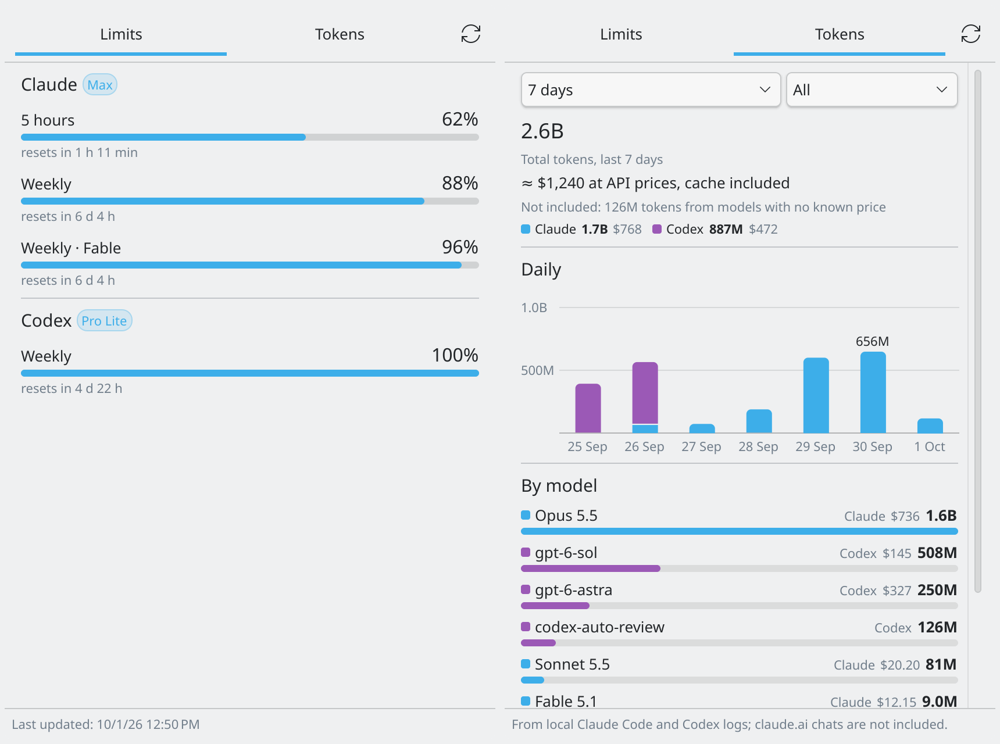
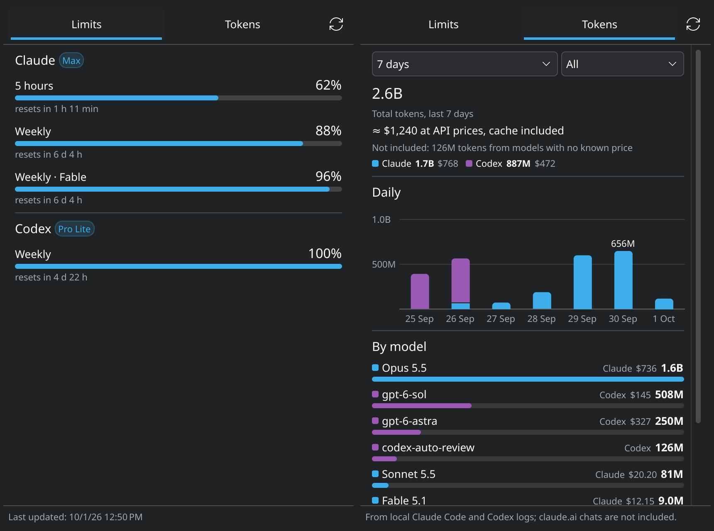

# Agents Usage

A KDE Plasma 6 widget that shows how much of the 5-hour and weekly limits are left on your Claude and OpenAI Codex subscriptions, plus a second tab with tokens by day and by model counted from the local Claude Code and Codex logs (so only as far back as those tools keep them, and without claude.ai chats) and what they would have cost at API list prices, cache included, using LiteLLM's public price list fetched once a day. The text follows the system language, English or Turkish. It reads the logins Claude Code (`~/.claude/.credentials.json`) and the Codex CLI (`~/.codex/auth.json`) already keep, so both need to be signed in once. An expired Codex token is refreshed the way the CLI does it and written back to `auth.json`; the Claude token is only read, so after a long break from Claude Code the widget shows the last known numbers until you open `claude` again. It refreshes every 5 minutes and whenever the popup opens.




## Install

Needs Plasma 6, `python3`, and `msgfmt` (gettext) for the Turkish translation.

```sh
git clone https://github.com/yusufipk/kde-agents-usage.git
cd kde-agents-usage
./install.sh
```

Then add "Agents Usage" to a panel (right click the panel, Add Widgets), or open the system tray arrow, Configure System Tray, and set it to always shown. To update, run `git pull && ./install.sh` and restart Plasma with `systemctl --user restart plasma-plasmashell`.
